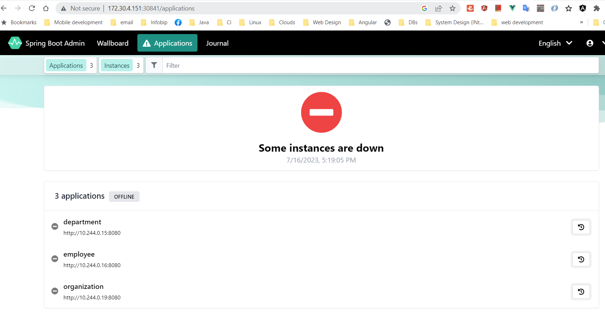

https://piotrminkowski.com/2023/06/08/spring-cloud-kubernetes-with-spring-boot-3/
- 
# What is Kubernetes Java Client/fabric8  use for ? Mozda se koristi umjesto Ribon Discober Client-a ? 
  Vjeerovatno da je to razlog jer sam nasao u yaml file-vima: robbon.enabled: false 
  Medjutim nasao sam u svim servisima @EnableDiscoveryClient ali moguc eje da se fabric8 koristi kao DiscoveryClient
  A vidio sam da se koristi i @FeignClient !

# Those properties from configmap.yaml are injected into the pod as the application.properties file. 
  And now the most important thing. The name of the ConfigMap has to be the same as the name of our app. 
  The name of the Spring Boot is indicated by the spring.application.name property.

- Spring Cloud Kubernetes requires special privileges on Kubernetes to interact with the master API (1). 
  We don’t have to provide a tag for the image – Skaffold will handle it (2). 
  In order to enable loading properties from ConfigMap we need to set the spring.config.import=kubernetes: property (a new way) 
  or set the property spring.cloud.bootstrap.enabled to true (the old way). 
- Instead of using properties directly, we will set the corresponding environment variables on the Deployment (3) ( - name: SPRING_CLOUD_BOOTSTRAP_ENABLED
  value: "true"). 
- By default, consuming secrets through the API is not enabled for security reasons. 
- In order to enable it, we will set the SPRING_CLOUD_KUBERNETES_SECRETS_ENABLEAPI environment variable to true (4).

Using Spring Cloud Kubernetes Discovery (Dobro sam zakljucio gore u prvom pitanju):

- We have already included the Spring Cloud Kubernetes Discovery module in the previous section using the 
  spring-cloud-starter-kubernetes-fabric8-all starter. In order to provide a declarative REST client we will also include the Spring Cloud OpenFeign module:

- Now, we can declare the @FeignClient interface. The important thing here is the name of a discovered service. 
  It should be the same as the name of the Kubernetes Service defined for the employee-service app.

- Here’s the Kubernetes Service manifest for the employee-service app. The name of the service is employee (1). 
  The label spring-boot is set for Spring Boot Admin discovery purposes (2).  
  You can find the following YAML in the employee-service/k8s directory.

- That’s all that we have to do. Now, we can just call the endpoint using the OpenFeign client from department-service. 
  For example on the “delayed” endpoint, we can use Spring Cloud Circuit Breaker with Resilience4J.

- Testing with Fabric8 Kubernetes
  We have already finished the implementation of our service. All the Kubernetes YAML manifests are prepared and ready to deploy. 
  Now, the question is – can we easily test that everything works fine before we proceed to the deployment on the real cluster? 
  The answer is – yes. Moreover, we can choose between several tools. 
  Let’s begin with the simplest option – Kubernetes mock server. In order to use it, we to include an additional Maven dependency:

<dependency>
  <groupId>io.fabric8</groupId>
  <artifactId>kubernetes-server-mock</artifactId>
  <version>6.7.1</version>
  <scope>test</scope>
</dependency>

# We can also display a list of services. Some of them, like admin or gateway, are exposed as NodePort. Thanks to that we can easily access them outside of our Kubernetes cluster.

kubectl get svc
NAME           TYPE        CLUSTER-IP       EXTERNAL-IP   PORT(S)          AGE
admin          NodePort    10.101.220.141   <none>        8080:31368/TCP   3m53s
department     ClusterIP   10.108.144.90    <none>        8080/TCP         3m52s
employee       ClusterIP   10.99.75.2       <none>        8080/TCP         3m52s
gateway        NodePort    10.96.7.237      <none>        8080:31518/TCP   3m52s
kubernetes     ClusterIP   10.96.0.1        <none>        443/TCP          38h
mongodb        ClusterIP   10.108.198.233   <none>        27017/TCP        3m53s
organization   ClusterIP   10.107.102.26    <none>        8080/TCP         3m52s
Let’s obtain the Minikube IP address on our local machine:

$ minikube ip
- Now, we can use that IP address to access e.g. Spring Boot Admin Server on the target port. For me its 31368. 
  Spring Boot Admin should successfully discover all three microservices and connect to the /actuator endpoints exposed 
  by that apps.

